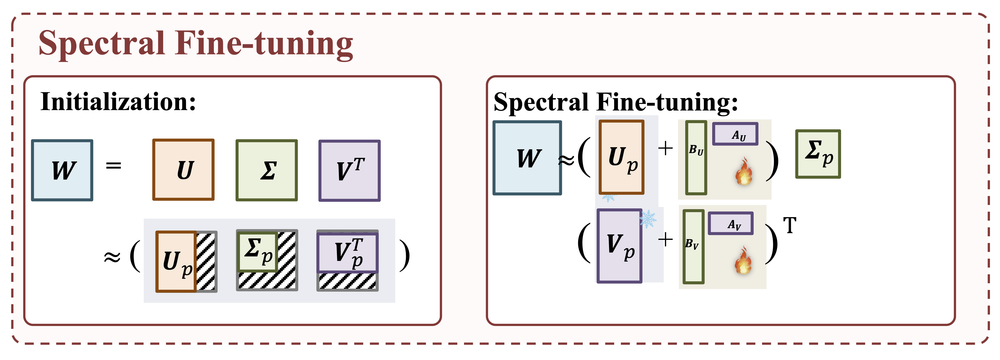

# SpectralFT

Previous research has shown that the principal singular vectors of a pre-trained model's weight matrices capture critical knowledge. In contrast, those associated with small singular values may contain noise or less reliable information. As a result, the LoRA-based parameter-efficient fine-tuning (PEFT) approach, which does not constrain the use of the spectral space, may not be effective for tasks that demand high representation capacity. In this study, we enhance existing PEFT techniques by incorporating the spectral information of pre-trained weight matrices into the fine-tuning process. We investigate spectral adaptation strategies with a particular focus on the additive adjustment of top singular vectors. This is accomplished by applying singular value decomposition (SVD) to the pre-trained weight matrices and restricting the fine-tuning within the top spectral space. Extensive speaker verification experiments on VoxCeleb1 and CN-Celeb1 demonstrate enhanced tuning performance with the proposed approach.

<div align="center">
  
</div>


$$
\text{SpectralFT}(\boldsymbol{W}) := [\boldsymbol{U}_p + \boldsymbol{\Delta}_U] \boldsymbol{\Sigma}_p [\boldsymbol{V}_p + \boldsymbol{\Delta}_V]^\textsf{T},
$$

# Citation

```bibtex
@inproceedings{Li2025SpectralAware,
  author    = {Zhe Li and Man-wai Mak and Mert Pilanci and Hung-yi Lee and Helen Meng},
  title     = {Spectral-Aware Low-Rank Adaptation for Speaker Verification},
  booktitle = {Proc. of the IEEE International Conference on Acoustics, Speech and Signal Processing (ICASSP)},
  year      = {2025}
}


